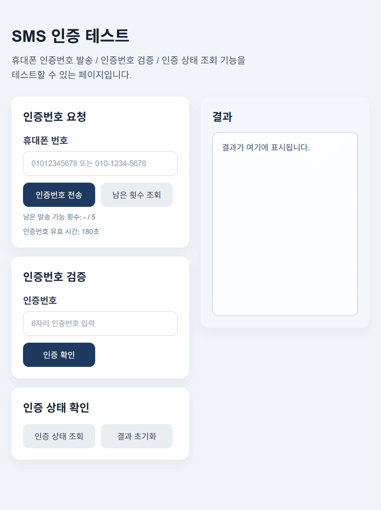
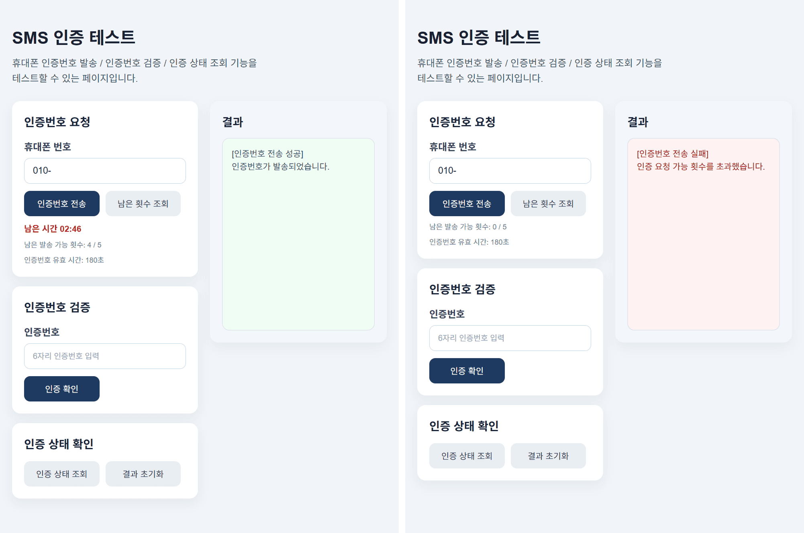
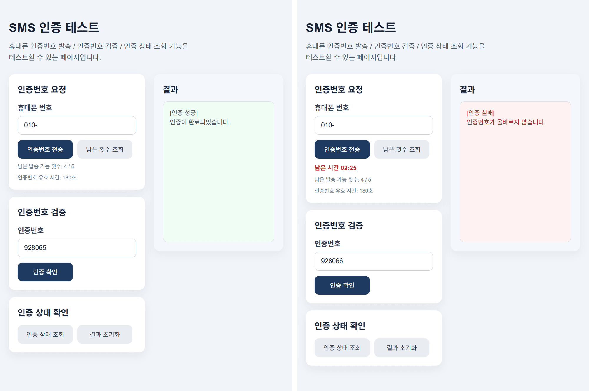
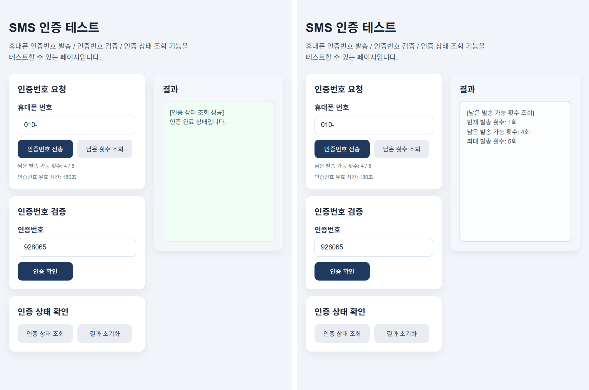

# SMS Auth (Spring Boot + Redis)

 

Spring Boot 환경에서 Redis와 Solapi API를 활용해

문자 인증 기능을 구현한 프로젝트입니다.

 

> 관련 내용은 [블로그 글](https://velog.io/@kimkaaa/Spring-Boot-Redis%EC%99%80-Solapi%EB%A1%9C-%EB%AC%B8%EC%9E%90-%EC%9D%B8%EC%A6%9D-%EA%B5%AC%ED%98%84%ED%95%98%EA%B8%B0)에서 확인할 수 있습니다.

 

## 실행 화면

  
입력 화면

   
  

  
인증번호 발송

   
  

  
문자수신 결과

   
  

  
인증번호 검증

   
  

  
조회 (인증 상태 / 남은 발송 횟수)

   
  

 

## 인증 흐름

- 인증번호 요청 → 번호 형식 검증 → 발송 횟수 확인 → 인증번호 생성 → 문자 발송 → Redis 저장
- 인증번호 검증 요청 → Redis 조회 → 값 비교 → 성공 시 상태 저장 / 실패 시 횟수 증가

 

## 상태 관리

- 인증번호, 발송 횟수, 인증 실패 횟수, 인증 상태를 Redis Key로 분리해 관리합니다.
- 인증번호는 TTL 기반으로 자동 만료됩니다.
- 발송 횟수와 인증 실패 횟수는 설정된 횟수 제한에 따라 관리됩니다.
- 인증 성공 시 인증 상태를 일정 시간 유지하며, 상태 조회로 확인할 수 있습니다.

 

## 구현 방식

- 인증 흐름은 `SmsAuthService`, Redis 저장/조회는 `SmsAuthStore`로 분리했습니다.
- 문자 발송은 `SmsSender` 인터페이스로 추상화하고, Solapi 연동은 구현체에서 처리합니다.
- Solapi API 연동 시 HMAC-SHA256 기반 인증 헤더를 생성해 요청합니다.
- 인증 관련 설정값은 프로퍼티로 분리했습니다.

 

## 기술 스택

- Java 17
- Spring Boot 3.5.13
- Redis
- Solapi SMS API
